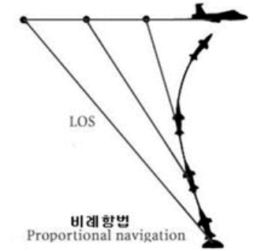
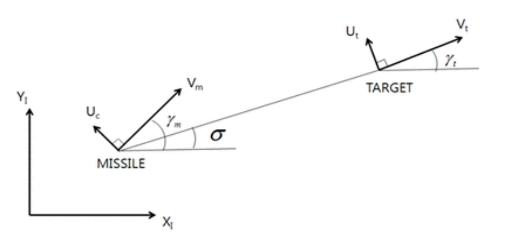

# 유도탄 운동방정식

2021.07.05 월

## 비례 항법 유도 (Proportional Navigation Guidance)

- 대부분 대공 미사일 (지상에서 비행 표적을 상대로 발사하는 미사일)에 사용하는 방식
- 비례항법은 미사일과 목표물 사이의 각도가 변하는 변화율(rate)를 계산하고, 미리 목표물과 충돌할 코스를 계산하여 미래위치에 미사일을 유도하는 방식

- 미사일 내장된 시스템에 의해, 혹은 지상의 지령유도 시스템에 의해 이 변화율을 측정 하고 코스를 계산한다.
- 원거리에서는 변화율이 작으므로 미사일이 거의 경로를 변경하지 않고 있다가, 미사일의 미드코스(중간단계)에서 목표물에 명중할 수 있는 궤적을 유지하므로 미사일의 에너지를 최대한 많이 유지할 수 있다는게 큰 장점
- 목표물의 미래위치를 산정하여 미래위치에 미사일의 경로를 미리잡아 미사일과 목표물과의 속도 , 각도, 고도 등을 계산하여 미래위치에서 명중되도록 유도하는 항법

- 발사 시점에서의 미사일과 표적과의 각이 시선각(Light of Sight Angle, LOS)을 발 사 후 표적을 추적하는 동안 일정하게 유지시켜 주게 되면 표적을 맞출 수 있음. (**이 때 반드시 표적의 속도보다 미사일의 속도가 커야함**)
- LOS를 일정하게 유지시키면서 변화율이 0이 되는 순간 명중

## 운동방정식

- 미사일을 Vm의 속도로 운동하고 있으며 속도 방향에 수직으로 Uc의 입력을 가해서 방향 전환을 시킨다고 가정
- 마찬가지로  표적도 Vt와 Ut 의 두가지 성분이 있다고 가정
- LOS 는 sigma, Flight Path angle은 각각 gamma_m , gamma_t 로 가정 

$$
\sigma = tan^{-1}\frac{y_t - y_m}{x_t-x_m}
$$
​	시간에 대하여 미분하면,
$$
\dot{\sigma} = \frac{cos^2\sigma}{(x_t-x_m)^2}\{(\dot{y_t}-\dot{y_m})(x_t-x_m)-(y_t-y_m)(\dot{x_t}-\dot{x_m})\}
$$
​	이를 간단히 하면 다음과 같다.
$$
\dot{\sigma}=\frac{cos^2\sigma}{(\triangle x)^2}\{V_{fy}\triangle x-V_{fx}\triangle y\}
$$

$$
where \,\,\, V_{fy} = V_{ty} - V_{my}=V_tsin\gamma_t - V_msin\gamma_m \,\,\,\,\,\,\,\,\,\,\,\,\,\,\,\,V_{fx} = V_{tx}-V_{mx}=V_tcos\gamma_t-V_mcos\gamma_m
$$

#### 미사일 운동방정식

$$
\dot{\gamma_m} = \frac{U_c}{V_m}
$$

​	
$$
\dot{x_m} = V_mcos\gamma_m
$$
​	
$$
\dot{y_m} = V_msin\gamma_m
$$

